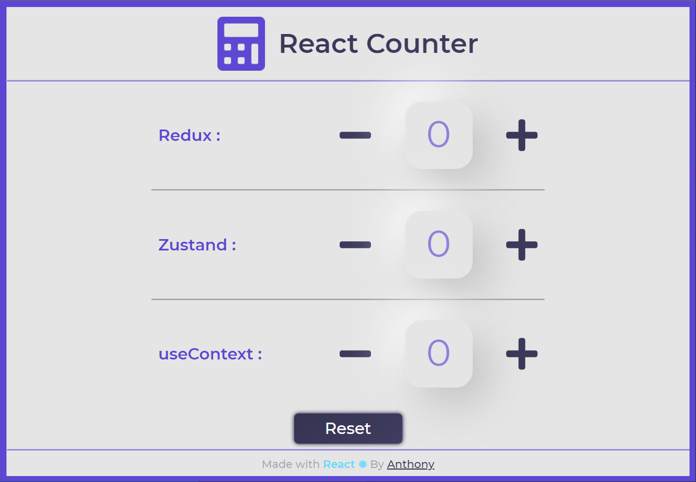

# React Counter - State Management

<div align="center">
A simple demo project that implements counters using different state management technologies for each.
</div>



## Live demo
URL: 

## About The Project
This project has been developped using ReactJS. This is a very simple architecture made for learning purposes.
### State Management
So far, three state managers are implemented in the same project:
- Redux
- Zustand
- useContext (+ useReducer)

### Other informations
- Each counter goes from 0 to 10.
- To help understand, open the Console section of the browser inspector and get into the 3 children components to see how it works.

## Get Started

Install the dependencies:

```sh
$ yarn
```

Run in dev mode:

```sh
$ yarn start
```


## Contact 📭
If this project helped you in a way, please don't forget to **give it a star ⭐!** Thanks again!

Any questions, [hit me up on Twitter](https://twitter.com/anthonyrovirajs).

## License

Distributed under the MIT License. See `LICENSE.txt` for more information.